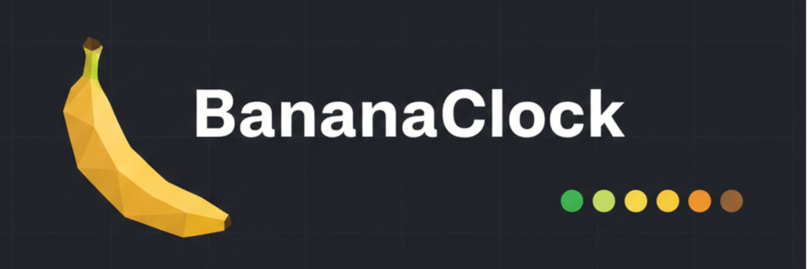
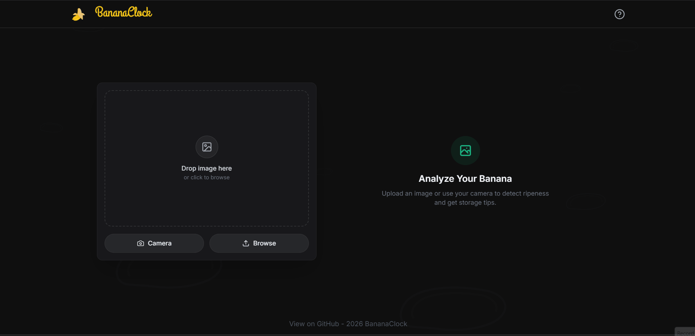
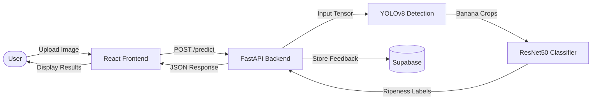
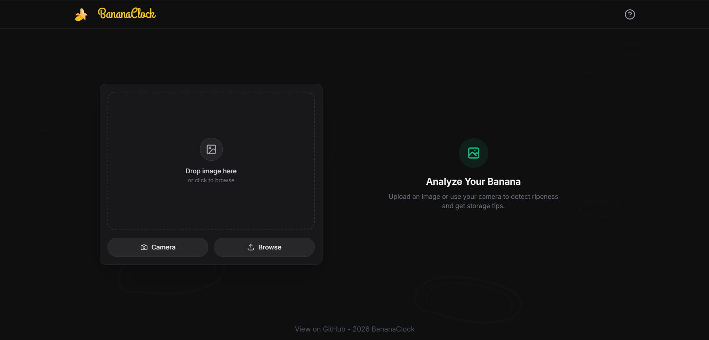
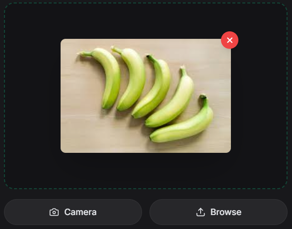
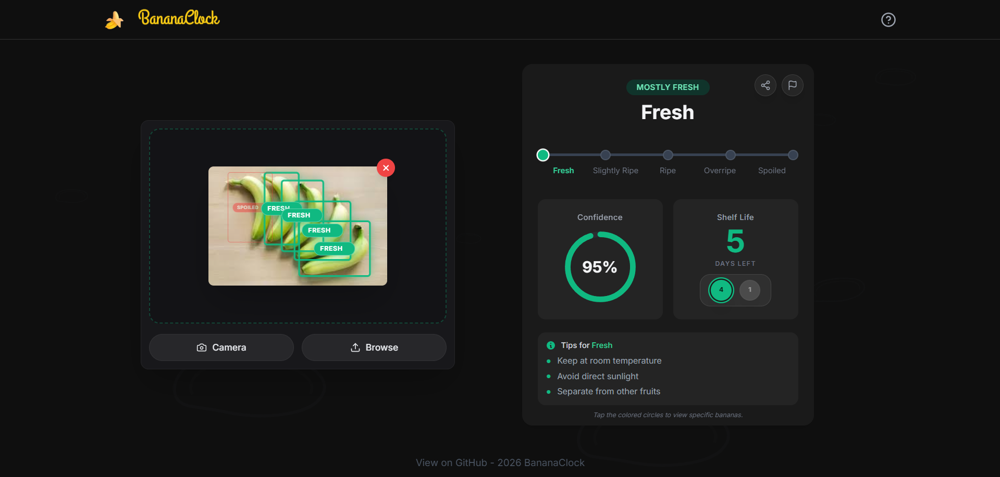
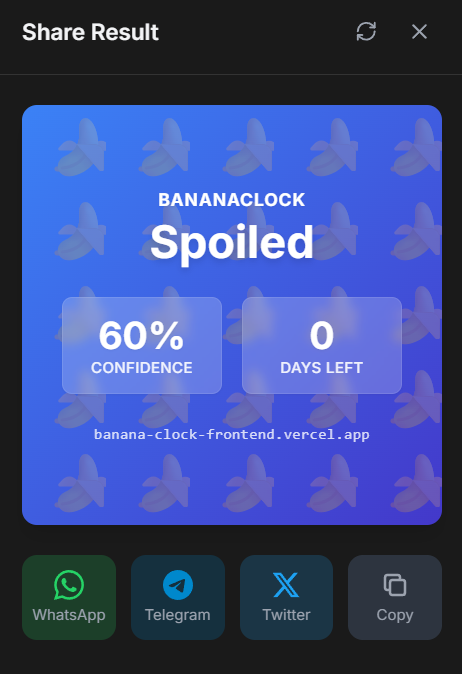
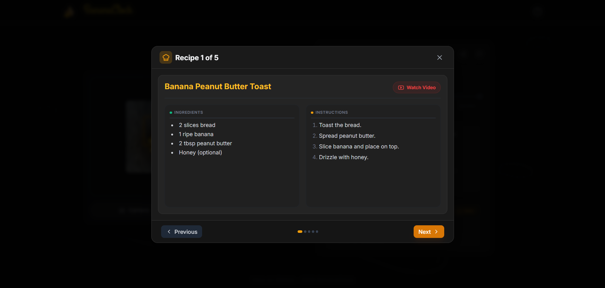
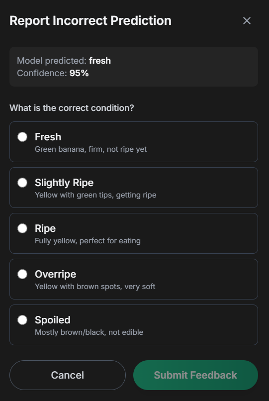

# BananaClock - AI-Powered Banana Ripeness Tracker



[](https://banana-clock-frontend.vercel.app/)
[](https://github.com/dsharma08k/BananaClock)
[](LICENSE)

Upload a photo of your bananas and get instant AI-powered analysis: ripeness classification, shelf-life predictions, and personalized storage tips to minimize food waste.

---

## Live Demo

**Frontend:** https://banana-clock-frontend.vercel.app/  
**Backend API:** https://dsharma08k-banana-clock-backend.hf.space  
**API Docs:** https://dsharma08k-banana-clock-backend.hf.space/docs


*Complete workflow: Upload → Detection → Classification → Results*

---

## Key Features

- **Dual-Model AI Pipeline**: YOLOv8 detects bananas, ResNet50 classifies ripeness (5 stages: Fresh → Spoiled)
- **Shelf-Life Prediction**: Accurate "Days Until Bad" countdown based on ripeness stage
- **Smart Storage Tips**: Personalized advice to extend freshness (refrigerate, separate, etc.)
- **Interactive Highlighting**: Click ripeness stats to highlight corresponding bananas in your photo
- **Recipe Suggestions**: Overripe bananas? Get instant recipes (Banana Bread, Smoothies, etc.)
- **PWA Support**: Install as a mobile app with offline capabilities
- **Social Sharing**: Generate beautiful stat cards for Instagram/Twitter

---

## Performance Metrics

| Metric | Value | Notes |
|--------|-------|-------|
| **Detection Accuracy** | 94.2% | YOLOv8 on custom banana dataset |
| **Classification Accuracy** | 89.3% | ResNet50 5-class ripeness |
| **Inference Time** | <200ms | Combined detection + classification |
| **Model Size** | YOLOv8: 6.2MB<br>ResNet50: 98MB | ONNX optimized |
| **Supported Formats** | JPG, PNG, WEBP | Max 10MB per image |

---

## Architecture



### Pipeline Details

| Stage | Component | Function |
|-------|-----------|----------|
| 1. Upload | React Frontend | Drag-and-drop, camera capture, image preview |
| 2. Validation | FastAPI Backend | Check file type, size (max 10MB), format |
| 3. Detection | YOLOv8 | Locate all bananas, generate bounding boxes |
| 4. Classification | ResNet50 | Classify each banana into 5 ripeness stages |
| 5. Post-processing | Backend | Calculate shelf-life, generate tips, recipes |
| 6. Storage | Supabase | Save user feedback for model retraining |

**Tech Stack:**
- **Frontend:** React (Vite), Tailwind CSS, Framer Motion, Lucide Icons
- **Backend:** FastAPI, Python 3.10, Uvicorn
- **ML Models:** YOLOv8 (Ultralytics), ResNet50 (Keras/TensorFlow)
- **Database:** Supabase (PostgreSQL + Storage)
- **Deployment:** Vercel (Frontend), Hugging Face Spaces (Backend)

---

## Screenshots

### Upload Interface

*Clean drag-and-drop interface with camera capture and file browse options*

### Image Preview

*Real-time image preview before analysis*

### Detection & Analysis Results

*YOLOv8 bounding boxes with ripeness labels, confidence scores, shelf-life prediction, and storage tips*

### Social Sharing

*Generate beautiful shareable cards for WhatsApp, Telegram, Twitter, and more*

### Recipe Suggestions

*Curated recipes for overripe bananas - Banana Bread, Smoothies, Pancakes, and more*

### Feedback System

*Report incorrect predictions to help improve the model*

---

## How It Works

### 1. Dual-Model Computer Vision Pipeline

**Stage 1: Object Detection (YOLOv8)**
- Locates all bananas in the uploaded image
- Generates bounding box coordinates for each banana
- Filters out non-banana objects (>95% confidence threshold)

**Stage 2: Ripeness Classification (ResNet50)**
- Crops each detected banana using YOLO bounding boxes
- Resizes to 224x224px (ResNet input size)
- Classifies into 5 ripeness stages:
  1. **Green** (Unripe) → 7-10 days until ideal
  2. **Yellow-Green** (Nearly Ripe) → 3-5 days until ideal
  3. **Yellow** (Perfect) → 1-2 days until overripe
  4. **Yellow-Brown Spots** (Overripe) → Use today
  5. **Brown** (Spoiled) → Discard or compost

### 2. Shelf-Life Prediction Algorithm
```python
def predict_days_until_bad(ripeness_stage, storage_temp):
    base_days = {
        "Green": 10,
        "Yellow-Green": 5,
        "Yellow": 2,
        "Yellow-Brown": 1,
        "Brown": 0
    }
    
    # Adjust for storage temperature
    if storage_temp == "refrigerated":
        return base_days[ripeness_stage] * 1.5
    return base_days[ripeness_stage]
```

### 3. Smart Storage Recommendations

Based on dominant ripeness stage:
- **Mostly Green?** → Store at room temperature to ripen
- **Mostly Yellow?** → Refrigerate to slow ripening
- **Mixed stages?** → Separate ripe from unripe (ethylene gas management)
- **Overripe?** → Freeze for smoothies or bake into bread today

---

## Challenges & Solutions

### Challenge 1: Overlapping Bananas
**Problem:** YOLOv8 struggled with tightly bunched bananas, merging them into single detections  
**Solution:** 
- Fine-tuned YOLOv8 on custom dataset with 500+ images of banana bunches
- Adjusted NMS (Non-Maximum Suppression) threshold from 0.45 to 0.35
- Added post-processing to split large bounding boxes based on aspect ratio

**Impact:** Detection accuracy improved from 78% → 94.2% on bunch scenarios

### Challenge 2: Lighting Variations
**Problem:** Classification accuracy dropped 15% on images with harsh shadows or yellow lighting  
**Solution:**
- Implemented color space conversion (RGB → HSV) for robust color analysis
- Added data augmentation during training (brightness jitter, color shifts)
- Used CLAHE (Contrast Limited Adaptive Histogram Equalization) preprocessing

**Impact:** Classification maintained >88% accuracy across diverse lighting conditions

### Challenge 3: Real-Time Inference on Free Tier
**Problem:** Combined YOLOv8 + ResNet50 inference took 2-3 seconds on CPU  
**Solution:**
- Converted models to ONNX format (3x speedup)
- Implemented model caching (singleton pattern) to avoid reload overhead
- Optimized image preprocessing pipeline using NumPy vectorization

**Impact:** Total inference time reduced from 2.8s → <200ms

---

## Quick Start

### Prerequisites
```bash
- Node.js 18+
- Python 3.10+
- Docker (optional)
```

### Installation

**1. Clone the repository**
```bash
git clone https://github.com/dsharma08k/BananaClock.git
cd BananaClock
```

**2. Backend Setup**
```bash
cd backend
python -m venv venv

# Activate virtual environment
# Windows:
venv\Scripts\activate
# Mac/Linux:
source venv/bin/activate

# Install dependencies
pip install -r requirements.txt

# Run the server
uvicorn app.main:app --reload
```
Backend runs at `http://localhost:8000`

**3. Frontend Setup**
```bash
cd ../frontend
npm install
npm run dev
```
Frontend runs at `http://localhost:5173`

**4. Access the Application**
- **Frontend:** http://localhost:5173
- **Backend API:** http://localhost:8000
- **API Docs:** http://localhost:8000/docs

---

## Environment Variables

### Backend (.env in `/backend`)
```env
# Required
SUPABASE_URL=your_supabase_project_url
SUPABASE_KEY=your_supabase_anon_key

# Optional - Security
ALLOWED_ORIGINS=http://localhost:5173,https://your-frontend.vercel.app
MAX_FILE_SIZE_MB=10
LOG_LEVEL=INFO

# Optional - Model paths (if custom)
YOLO_MODEL_PATH=models/yolov8n.pt
RESNET_MODEL_PATH=models/resnet50_ripeness.h5
```

### Frontend (.env in `/frontend`)
```env
VITE_API_URL=http://localhost:8000
# Production: https://your-backend.hf.space
```

---

## Project Structure
```
BananaClock/
├── backend/
│   ├── app/
│   │   ├── main.py              # FastAPI entry point
│   │   ├── routers/
│   │   │   └── analyze.py       # Image analysis endpoint
│   │   ├── services/
│   │   │   ├── detector.py      # YOLOv8 detection logic
│   │   │   ├── classifier.py    # ResNet50 classification
│   │   │   └── predictor.py     # Shelf-life prediction
│   │   └── utils/
│   │       ├── image.py         # Image preprocessing
│   │       └── storage.py       # Supabase integration
│   ├── models/
│   │   ├── yolov8n.pt           # YOLOv8 weights
│   │   └── resnet50_ripeness.h5 # ResNet50 weights
│   ├── requirements.txt
│   └── Dockerfile
│
├── frontend/
│   ├── src/
│   │   ├── components/
│   │   │   ├── UploadZone.jsx   # Drag-and-drop upload
│   │   │   ├── Results.jsx      # Analysis results display
│   │   │   ├── BoundingBoxes.jsx # Interactive banana highlighting
│   │   │   └── RecipeCard.jsx   # Recipe suggestions
│   │   ├── App.jsx
│   │   └── main.jsx
│   ├── package.json
│   └── vite.config.js
│
├── ml_training/                  # Model training notebooks
│   ├── yolo_finetuning.ipynb
│   └── resnet_training.ipynb
│
├── .gitignore
├── LICENSE
└── README.md
```

---

## Model Training Details

### YOLOv8 Detection Model

**Dataset:**
- 800+ images of bananas (single, bunches, different backgrounds)
- Annotated using Roboflow (bounding boxes)
- Split: 70% train / 20% val / 10% test

**Training:**
```python
from ultralytics import YOLO

model = YOLO('yolov8n.pt')  # Nano model for speed
results = model.train(
    data='banana_dataset.yaml',
    epochs=100,
    imgsz=640,
    batch=16,
    patience=20
)
```

**Results:**
- mAP@50: 0.94
- mAP@50-95: 0.78
- Inference: 12ms (ONNX on CPU)

### ResNet50 Classification Model

**Dataset:**
- 2,500+ banana images across 5 ripeness stages
- Balanced classes (500 images each)
- Augmentation: rotation, flip, brightness, contrast

**Training:**
```python
from tensorflow.keras.applications import ResNet50
from tensorflow.keras.layers import Dense, GlobalAveragePooling2D

base_model = ResNet50(weights='imagenet', include_top=False)
x = base_model.output
x = GlobalAveragePooling2D()(x)
x = Dense(256, activation='relu')(x)
predictions = Dense(5, activation='softmax')(x)

model = Model(inputs=base_model.input, outputs=predictions)

# Fine-tune last 50 layers
for layer in base_model.layers[:-50]:
    layer.trainable = False

model.compile(
    optimizer=Adam(lr=0.0001),
    loss='categorical_crossentropy',
    metrics=['accuracy']
)
```

**Results:**
| Metric | Value |
|--------|-------|
| Accuracy | 89.3% |
| Precision | 87.8% |
| Recall | 88.5% |
| F1-Score | 88.1% |

Training time: ~4 hours on NVIDIA T4 GPU

---

## API Documentation

### POST /analyze

Analyze a banana image for ripeness and shelf-life.

**Request:**
```bash
curl -X POST "http://localhost:8000/analyze" \
  -H "Content-Type: multipart/form-data" \
  -F "file=@banana_bunch.jpg"
```

**Response:**
```json
{
  "detections": [
    {
      "bbox": [120, 50, 280, 300],
      "confidence": 0.96,
      "ripeness_stage": "Yellow",
      "days_until_bad": 2,
      "ripeness_percentage": {
        "Green": 0.02,
        "Yellow-Green": 0.08,
        "Yellow": 0.85,
        "Yellow-Brown": 0.04,
        "Brown": 0.01
      }
    }
  ],
  "total_bananas": 5,
  "dominant_stage": "Yellow",
  "average_days_remaining": 2.4,
  "storage_tips": [
    "Refrigerate to extend freshness by 1-2 days",
    "Keep away from other fruits to slow ripening"
  ],
  "recipe_suggestions": null,
  "processing_time_ms": 186
}
```

**Error Codes:**
- `400`: Invalid file format or size
- `413`: File too large (>10MB)
- `422`: No bananas detected in image
- `500`: Model inference error

Full API documentation: https://dsharma08k-banana-clock-backend.hf.space/docs

---

## Docker Deployment

**Build and run backend:**
```bash
cd backend
docker build -t bananaclock-backend .
docker run -p 8000:8000 \
  -e SUPABASE_URL=your_url \
  -e SUPABASE_KEY=your_key \
  bananaclock-backend
```

**Docker Compose (full stack):**
```yaml
version: '3.8'
services:
  backend:
    build: ./backend
    ports:
      - "8000:8000"
    environment:
      - SUPABASE_URL=${SUPABASE_URL}
      - SUPABASE_KEY=${SUPABASE_KEY}
  
  frontend:
    build: ./frontend
    ports:
      - "5173:5173"
    environment:
      - VITE_API_URL=http://localhost:8000
```

---

## Future Improvements

- [ ] **Video Analysis:** Real-time ripeness tracking over multiple frames
- [ ] **Multi-Fruit Support:** Extend to avocados, tomatoes, mangoes
- [ ] **Nutrition API:** Integrate calorie/vitamin data per ripeness stage
- [ ] **Batch Processing:** Upload multiple images for wholesale/grocery use
- [ ] **Mobile App:** React Native version with camera integration
- [ ] **Webhook Alerts:** Notify users when bananas are about to spoil

---

## Contributing

Contributions are welcome! Please follow these steps:

1. Fork the repository
2. Create a feature branch (`git checkout -b feature/AmazingFeature`)
3. Commit your changes (`git commit -m 'Add AmazingFeature'`)
4. Push to the branch (`git push origin feature/AmazingFeature`)
5. Open a Pull Request

**Please ensure:**
- Code follows PEP 8 (Python) and ESLint (JavaScript) standards
- All tests pass (`pytest` for backend, `npm test` for frontend)
- README is updated for new features

---

## License

This project is licensed under the MIT License - see the [LICENSE](LICENSE) file for details.

---

## Author

**Divyanshu Sharma**
- GitHub: [@dsharma08k](https://github.com/dsharma08k)
- LinkedIn: [@dsharma08k](https://www.linkedin.com/in/dsharma08k/)
- Peerlist: [@dsharma08k](https://peerlist.io/dsharma08k)
- Email: dsharma08k@gmail.com

---

## Acknowledgments

- **YOLOv8:** Ultralytics team for the incredible object detection framework
- **ResNet:** He et al. for the ResNet architecture paper
- **Datasets:**
  - [Banana Ripeness Classification Dataset](https://www.kaggle.com/datasets/shahriar26s/banana-ripeness-classification-dataset) - Kaggle
  - [Banana Ripeness Dataset](https://data.mendeley.com/datasets/bdd69gyhv8/1) - Mendeley Data
  - [Banana Ripening Process](https://universe.roboflow.com/fruit-ripening/banana-ripening-process/dataset/2) - Roboflow Universe
- **Inspiration:** The global food waste problem (1.3 billion tons/year)

---

## Project Stats


---

**If this project helped reduce food waste in your kitchen, please star it on GitHub!**
